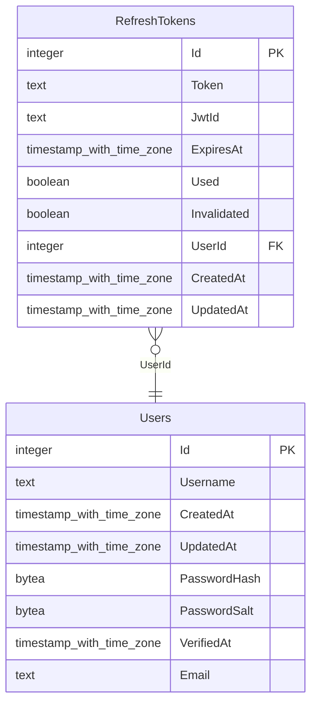

# Educational project

Just an educational project for repeating and consolidating acquired knowledge.

## Boards & Diagrams

- [Trello board](https://trello.com/b/PxRSBkcz/educational)
- [Miro board](https://miro.com/app/board/uXjVPNkyWYg=/?share_link_id=696849428200)
- [Dbdiagram](https://dbdiagram.io/d/6348207af0018a1c5ffa0aed) (for creating used PgAdmin => Backup => plain => Only schema => Remove all checkboxes => Generate .sql => Import to the dbdiagram)

## Applications

- [Backend](./backend) — [.NET 6](https://www.c-sharpcorner.com/article/what-is-new-in-net-6-0/), [PostgreSQL](https://www.postgresql.org)
- [Frontend](./frontend) — [Angular 14](https://angular.io/), [rxjs](https://rxjs.dev)

## Requirements

- [NodeJS](https://nodejs.org/en/) (16.10.x);
- [TypeScript](https://www.typescriptlang.org/) (4.8.x);
- [RxJS](https://rxjs.dev/) (7.4.x);
- [NPM](https://www.npmjs.com/) (8.x.x);
- [PostgreSQL](https://www.postgresql.org/) (14.2)

## Tools

- [pgAdmin](https://www.pgadmin.org/)
- [VSCode](https://code.visualstudio.com/)
- [Visual Studio](https://visualstudio.microsoft.com/vs/)

## DB Schema

